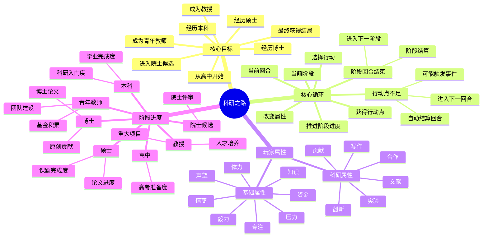
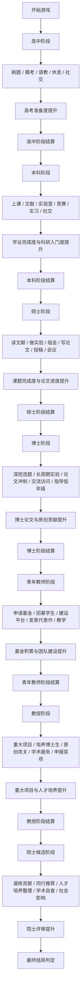
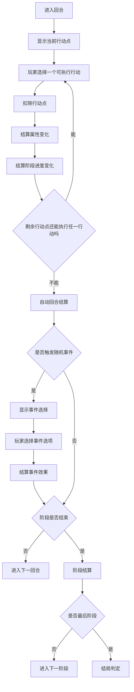
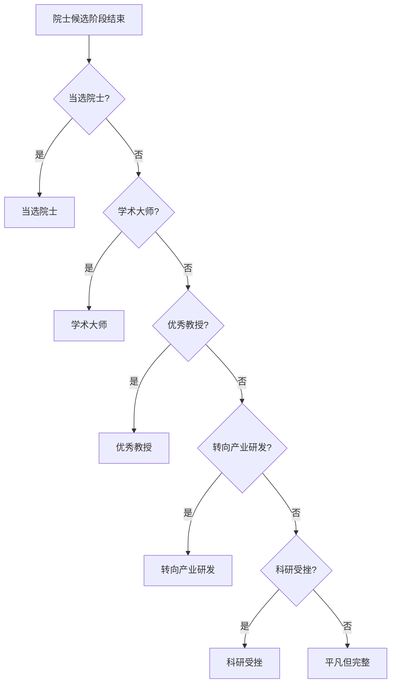
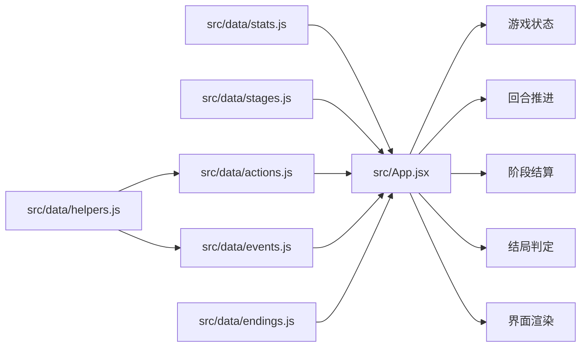

# 《科研之路》游戏流程思维导图

## 总览

## 阶段流程

## 单回合逻辑

## 结局判定

## 主要数据文件

## 读图顺序

1. 先看“总览”，理解游戏由目标、核心循环、属性和阶段进度组成。
2. 再看“阶段流程”，理解玩家从高中一路走到院士候选。
3. 然后看“单回合逻辑”，理解为什么现在没有手动结束回合。
4. 最后看“结局判定”和“主要数据文件”，方便继续开发和调数值。

